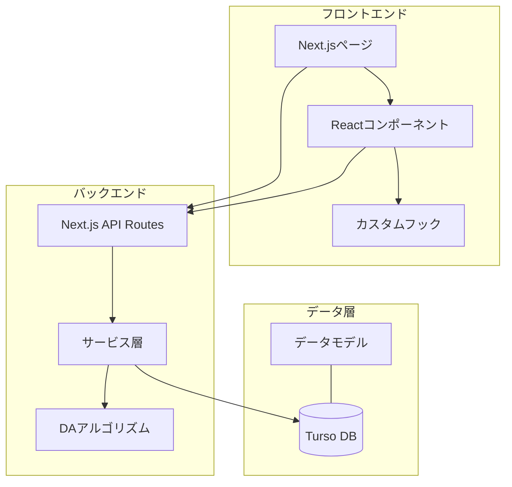
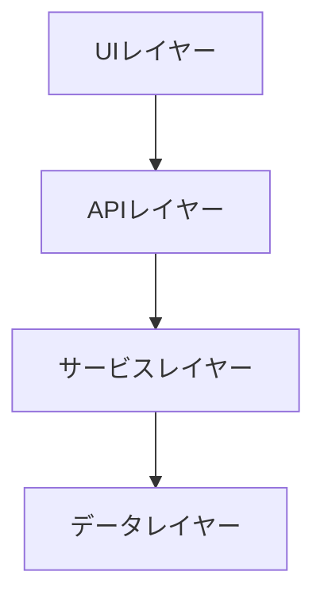
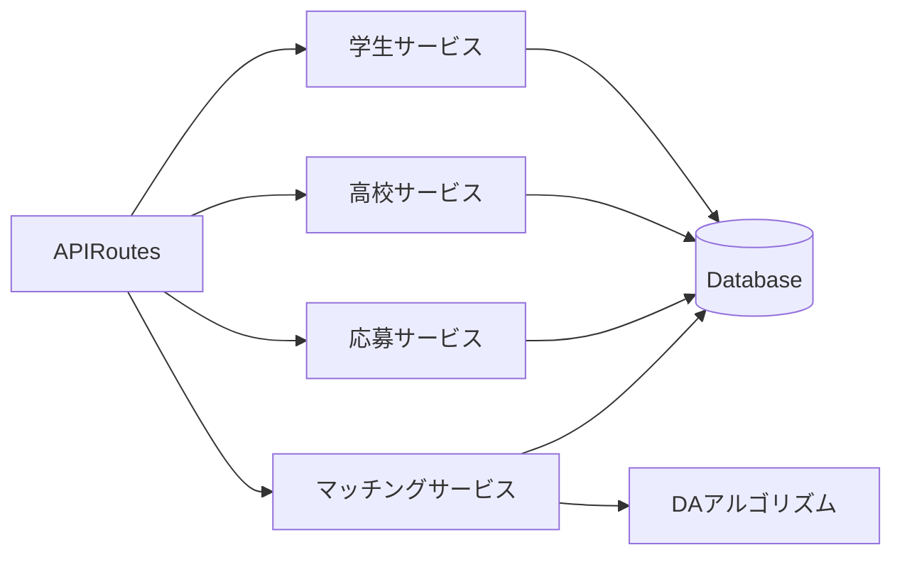
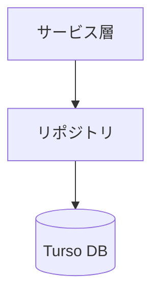
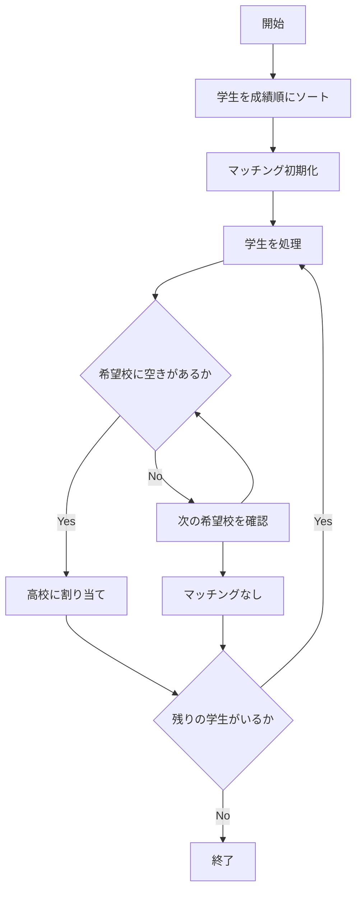
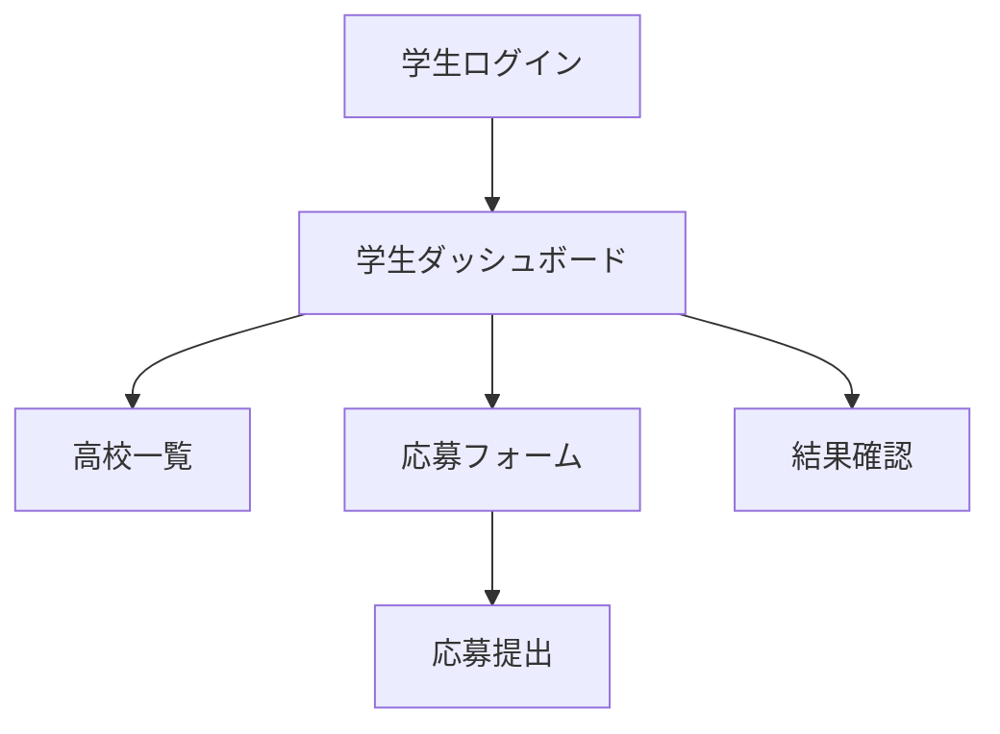
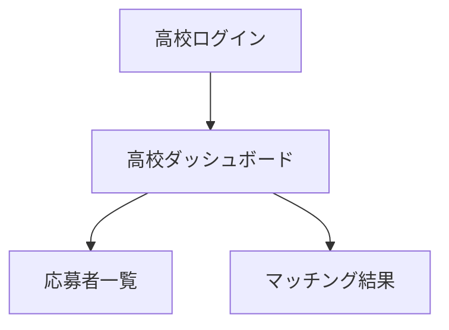
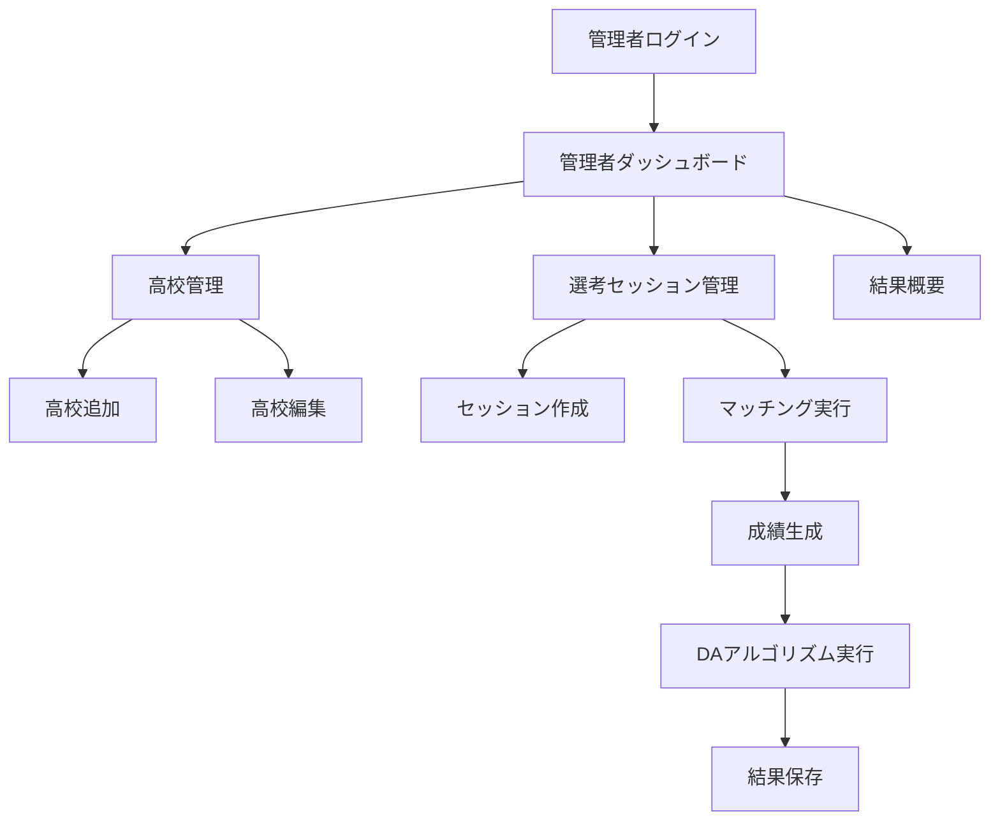

# システムパターン：日本公立高校入試マッチングシステム

## システムアーキテクチャ

このシステムは、Next.js、TypeScript、TailwindCSS、Tursoを使用したフルスタックアプリケーションとして実装されます。

## 主要コンポーネント

### フロントエンド

1. **ページコンポーネント**
   - 学生向けページ（応募フォーム、結果確認など）
   - 高校向けページ（応募状況確認、マッチング結果など）
   - 教育委員会向けページ（高校管理、選考セッション実行など）

2. **共通コンポーネント**
   - ナビゲーション
   - フォーム要素
   - テーブル・リスト表示
   - モーダル・ダイアログ
   - 通知・アラート

3. **カスタムフック**
   - API通信用フック
   - フォーム状態管理
   - 認証状態管理

### バックエンド

1. **API Routes**
   - 学生関連API（応募登録、結果取得など）
   - 高校関連API（情報取得、応募者リスト取得など）
   - 教育委員会関連API（高校管理、選考セッション実行など）

2. **サービス層**
   - 学生サービス
   - 高校サービス
   - 応募サービス
   - 選考セッションサービス
   - マッチングサービス

3. **DAアルゴリズム**
   - 学生の成績に基づくソート
   - 希望順位に基づくマッチング処理
   - 結果の保存と集計

### データ層

1. **データモデル**
   - 学生モデル
   - 高校モデル
   - 応募モデル
   - 選考セッションモデル
   - 試験結果・マッチング結果モデル

2. **Turso DB**
   - SQLiteベースのエッジデータベース
   - SQLクエリによるデータ操作

## 設計パターン

### 1. レイヤードアーキテクチャ

システムは以下の層に分かれています：

- **UIレイヤー**: ユーザーインターフェース（ページ、コンポーネント）
- **APIレイヤー**: Next.js API Routesによるエンドポイント
- **サービスレイヤー**: ビジネスロジック、アルゴリズム
- **データレイヤー**: データベースアクセス、モデル

### 2. サービスパターン

ビジネスロジックはサービスとして分離し、再利用性と保守性を高めます：

### 3. リポジトリパターン

データアクセスはリポジトリパターンを使用して抽象化します：

### 4. DAアルゴリズム実装

DAアルゴリズム（Deferred Acceptance Algorithm）は以下のステップで実装します：

## コンポーネント関係

### 学生フロー

### 高校フロー

### 教育委員会フロー

## 技術的決定

1. **Next.js App Router**: 最新のNext.js機能を活用し、ルーティングとサーバーコンポーネントを実装
2. **TypeScript**: 型安全性を確保し、開発効率と保守性を向上
3. **TailwindCSS**: 効率的なスタイリングとレスポンシブデザインの実現
4. **Turso**: 軽量で高速なSQLiteベースのエッジデータベースを使用
5. **サーバーアクション**: Next.jsのサーバーアクションを活用したフォーム処理
6. **クライアントコンポーネント**: インタラクティブなUI要素にはクライアントコンポーネントを使用
7. **サーバーコンポーネント**: データ取得やレンダリングが主な要素にはサーバーコンポーネントを使用
